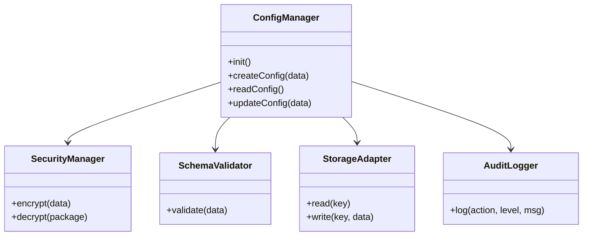

# Documentación Técnica: Config Manager

## 📦 Visión General
El módulo `ConfigManager` proporciona una solución robusta para la gestión segura de configuraciones en aplicaciones web. Implementa los siguientes estándares y tecnologías:

- **Seguridad**: Encriptación AES-256-GCM con derivación de claves PBKDF2 (100,000 iteraciones).
- **Persistencia**: Soporte dual para `localStorage` y `File System Access API` (archivos locales seguros).
- **Integridad**: Validación de esquemas JSON en tiempo de ejecución.
- **Auditoría**: Logger integrado con rotación de logs.

---

## 🚀 Guía de Implementación

### 1. Inicialización

```javascript
import { ConfigManager } from './js/config-manager/config-manager.js';

// Inicializar con la clave maestra del usuario
const configAuth = "usuario-super-secreto-123";
const manager = new ConfigManager(configAuth);

try {
    await manager.init();
    console.log("Sistema de configuración listo.");
} catch (error) {
    console.error("Error fatal iniciando config:", error);
}
```

### 2. Crear nueva configuración

```javascript
const defaultConfig = {
    version: 1,
    theme: {
        primaryColor: "#5327a0",
        darkMode: false
    },
    app: {
        autoSave: true,
        language: "es"
    }
};

try {
    await manager.createConfig(defaultConfig);
} catch (e) {
    if (e.code === 'SCHEMA_VALIDATION_FAILED') {
        alert("Datos inválidos: " + e.message);
    }
}
```

### 3. Leer configuración
```javascript
const config = await manager.readConfig();
if (config) {
    applyTheme(config.theme);
} else {
    // No existe config, crear default
}
```

### 4. Actualizar configuración
```javascript
await manager.updateConfig({
    theme: { 
        primaryColor: "#ff0000",
        darkMode: true 
    }
});
```

### 5. Uso de "Vault" con Archivos Locales (File System API)
Para navegadores modernos (Chrome/Edge):

```javascript
// Conectar a archivo existente
document.getElementById('btnLoadVault').onclick = async () => {
    const success = await manager.connectVault();
    if (success) {
        console.log("Conectado a archivo local seguro.");
        await manager.readConfig();
    }
};

// Crear nuevo archivo vault
document.getElementById('btnCreateVault').onclick = async () => {
    await manager.createVault();
};
```

---

## 🛠️ Arquitectura

### Diagrama de Clases (Simplificado)


---

## 🔍 Troubleshooting

| Código de Error | Causa Probable | Solución |
|-----------------|----------------|----------|
| `CONFIG_ENCRYPTION_ERROR` | Fallo en WebCrypto API. | El contexto seguro (HTTPS/localhost) es obligatorio. |
| `CONFIG_DECRYPTION_ERROR` | Contraseña maestra incorrecta o archivo dañado. | Verificar contraseña. Restaurar backup si persiste. |
| `SCHEMA_VALIDATION_FAILED` | Intento de guardar datos que violan el modelo. | Revisar `schema-validator.js` y los datos enviados. |
| `VAULT_CORRUPTED` | El JSON del vault no es válido. | Usar `manager.deleteConfig()` para resetear o restaurar manual. |

## 🧪 Tests
Para ejecutar las pruebas unitarias:

\`\`\`bash
npm install jest
npm test
\`\`\`
