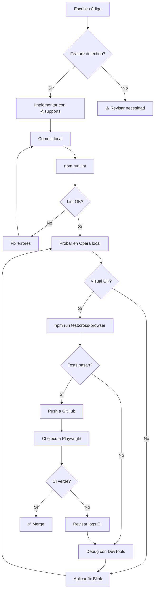

# ✅ Guía de Desarrollo Cross-Browser
## Creador de Invitaciones Digitales

**Versión**: 1.0  
**Fecha**: 2026-02-03  
**Mantenido por**: Equipo de Desarrollo

---

## 🎯 Propósito

Esta guía establece las **mejores prácticas** y **estándares de calidad** para garantizar que todas las features del Creador de Invitaciones funcionen correctamente en los navegadores soportados:

- ✅ **Firefox** (ESR 115+, Stable)
- ✅ **Opera** (70-95+)
- ✅ **Chrome** (100+)
- ✅ **Edge** (100+)
- ✅ **Chrome Mobile** (100+)
- ✅ **Samsung Internet** (15+)

---

## 📋 Checklist: Cross-Browser Ready

Antes de **cada commit** que afecte renderizado/CSS/JS client-side:

### 1. Feature Detection ✅

- [ ] ✅ Usar `@supports` en vez de user-agent sniffing
- [ ] ✅ Proveer fallback para propiedades experimentales
- [ ] ✅ Documentar compatibilidad en comentarios

**❌ MAL:**
```javascript
// User-agent sniffing (frágil, fácil de spoofear)
if (navigator.userAgent.includes('Opera')) {
    // Código específico...
}
```

**✅ BIEN:**
```css
/* Feature detection con @supports */
@supports (backdrop-filter: blur(10px)) {
    .content-section {
        backdrop-filter: blur(10px);
        background: rgba(255, 255, 255, 0.8);
    }
}

@supports not (backdrop-filter: blur(10px)) {
    .content-section {
        background: rgba(255, 255, 255, 0.95); /* Fallback más opaco */
    }
}
```

**✅ MEJOR (JavaScript):**
```javascript
// Detectar engine en vez de browser
class BrowserDetector {
    static get engine() {
        if (CSS.supports('(-webkit-appearance: none)') && 
            !CSS.supports('(-moz-appearance: none)')) {
            return 'blink';  // Chrome, Opera, Edge
        }
        if (CSS.supports('(-moz-appearance: none)')) {
            return 'gecko';  // Firefox
        }
        return 'unknown';
    }
    
    static hasFeature(property, value) {
        return CSS.supports(property, value);
    }
}

// Uso
if (BrowserDetector.engine === 'blink') {
    // Aplicar fix específico para Blink
}
```

---

### 2. Polyfills y Transpilación 🔧

- [ ] ✅ Verificar compatibilidad en [caniuse.com](https://caniuse.com)
- [ ] ✅ Cargar polyfills **solo cuando sean necesarios**
- [ ] ✅ No polyfill características con > 95% soporte

**Tabla de Decision:**

| Feature | Chrome | Firefox | Opera | Polyfill? |
|---------|--------|---------|-------|-----------|
| `IntersectionObserver` | 51+ | 55+ | 38+ | Sí (para versiones antiguas) |
| `ResizeObserver` | 64+ | 69+ | 51+ | Sí |
| `fetch()` | 42+ | 39+ | 29+ | No (> 95% soporte) |
| `Promise` | 32+ | 29+ | 19+ | No |
| `CSS Grid` | 57+ | 52+ | 44+ | No |

**Ejemplo de carga condicional:**

```javascript
// Polyfill solo si no existe
if (!('IntersectionObserver' in window)) {
    await import('intersection-observer');
}

// Ahora usar seguro
const observer = new IntersectionObserver(callback);
```

---

### 3. Print CSS ⚠️ CRÍTICO

- [ ] ✅ Siempre incluir `@media print`
- [ ] ✅ Usar `print-color-adjust: exact`
- [ ] ✅ Incluir prefijo `-webkit-` para Chrome/Opera
- [ ] ✅ **EVITAR** `break-inside: avoid` en flex containers

**Template Obligatorio:**

```css
@media print {
    @page {
        margin: 0;
        size: auto;
    }
    
    html, body {
        height: auto !important;
        min-height: 0 !important;
        overflow: visible !important;
    }
    
    /* Forzar colores */
    * {
        -webkit-print-color-adjust: exact !important;  /* WebKit/Blink */
        color-adjust: exact !important;                /* Estándar */
        print-color-adjust: exact !important;          /* Legacy */
    }
    
    /* Evitar cortes (PERO NO EN FLEX!) */
    section, .card, img {
        break-inside: avoid-page;  /* Más específico */
        page-break-inside: avoid;  /* Legacy */
    }
    
    /* ❌ NO HACER: break-inside en flex */
    /* .flex-container {
        break-inside: avoid;  ← Ignorado por Blink!
    } */
    
    /* ✅ HACER: Cambiar a block en print */
    .flex-container {
        display: block !important;
        break-inside: avoid-page;
    }
}
```

---

### 4. devicePixelRatio y Canvas 🎨

- [ ] ✅ No asumir `devicePixelRatio = 1`
- [ ] ✅ Escalar canvas correctamente
- [ ] ✅ Testear en pantallas Retina (2x) y HiDPI (3x)

**❌ MAL:**
```javascript
const canvas = document.createElement('canvas');
canvas.width = 800;   // Borroso en Retina!
canvas.height = 600;
```

**✅ BIEN:**
```javascript
const canvas = document.createElement('canvas');
const dpr = window.devicePixelRatio || 1;

// Tamaño físico en píxeles
canvas.width = 800 * dpr;
canvas.height = 600 * dpr;

// Tamaño CSS (lo que se ve)
canvas.style.width = '800px';
canvas.style.height = '600px';

// Escalar contexto
const ctx = canvas.getContext('2d');
ctx.scale(dpr, dpr);

// Ahora dibujar normalmente
ctx.fillRect(0, 0, 800, 600);
```

---

### 5. Testing Multi-Browser 🧪

- [ ] ✅ Probar en **Opera Developer** (más reciente)
- [ ] ✅ Firefox ESR (soporte largo plazo)
- [ ] ✅ Chrome Mobile (80%+ mercado móvil)
- [ ] ✅ Probar `-webkit-` prefixes

**Proceso de Testing:**

1. **Desarrollo**: Chrome/Firefox (más rápido)
2. **Pre-commit**: Opera, Chrome Mobile (críticos)
3. **Pre-merge**: Suite Playwright completa
4. **Post-deploy**: Monitoreo de errores en producción

**Comandos rápidos:**

```bash
# Test local en Opera (Windows)
start opera.exe http://localhost:8080

# Chrome con DevTools mobile
chrome.exe --auto-open-devtools-for-tabs http://localhost:8080

# Firefox Developer Edition
firefox-developer http://localhost:8080
```

---

## 🚫 Propiedades de Alto Riesgo

### CSS Properties

| Propiedad | Riesgo | Por qué | Alternativa |
|-----------|--------|---------|-------------|
| `overflow: hidden` en flex | 🔴 **Alto** | Blink clipea agresivamente | `overflow: clip` + `contain: paint` |
| `break-inside` en flex | 🔴 **Alto** | Ignorado por Blink | Cambiar a `display: block` en `@media print` |
| `backdrop-filter` | 🟡 Medio | No soportado < Firefox 103 | Fallback con `background: rgba()` opaco |
| `env(safe-area-*)` | 🟡 Medio | Solo iOS Safari / Android Chrome | Fallback `padding: 1rem` |
| `aspect-ratio` | 🟡 Medio | No en IE/Legacy Edge | Usar padding-hack o JS |
| `-webkit-text-fill-color` | 🟢 Bajo | Específico WebKit pero amplio | Funciona en Blink + Safari |

---

### JavaScript APIs

| API | Riesgo | Por qué | Alternativa |
|-----|--------|---------|-------------|
| `OffscreenCanvas` | 🔴 **Alto** | Solo Chrome 69+, Firefox 105+ | Canvas normal con workers |
| `ResizeObserver` | 🟡 Medio | No en Safari < 13.1 | Polyfill + resize event |
| `IntersectionObserver v2` | 🟡 Medio | Campos `isVisible` no universal | v1 con `intersectionRatio` |
| `navigator.userAgentData` | 🔴 **Alto** | Solo Chrome 90+, NO Firefox | Feature detection |
| `window.matchMedia().change` | 🔴 **Alto** | Nombre erróneo, usar `change` | `addEventListener('change')` |

---

## 🎨 Reglas CSS Críticas

### 1. Overflow Management

**Problema**: `overflow: hidden` + flexbox causa truncamiento en Blink.

**❌ NO:**
```css
.container {
    display: flex;
    overflow: hidden; /* ← Problema en Opera! */
}
```

**✅ SÍ:**
```css
.container {
    display: flex;
    overflow: visible; /* O 'clip' si necesitas ocultar */
}

/* Controlar scroll en nivel superior */
body {
    overflow-y: auto;
    overflow-x: hidden;
}
```

---

### 2. CSS Containment

**Problema**: `contain: paint` puede causar clipping prematuro en Blink.

**❌ NO:**
```css
.hero-section {
    contain: layout style paint; /* 'paint' causa problemas */
}
```

**✅ SÍ:**
```css
.hero-section {
    contain: layout style; /* Sin 'paint' */
}

/* O específico para Blink */
@supports (-webkit-appearance: none) and (not (-moz-appearance: none)) {
    .hero-section {
        contain: none; /* Deshabilitar en Blink si hay problemas */
    }
}
```

---

### 3. Object-fit en Imágenes

**Problema**: Algoritmo de `object-fit: cover` difiere entre motores.

**✅ Siempre especificar `object-position`:**

```css
.image {
    width: 200px;
    height: 200px;
    object-fit: cover;
    object-position: center center; /* ✅ Explícito */
    
    /* Prefijo para Blink/WebKit */
    -webkit-object-fit: cover;
    -webkit-object-position: center center;
}
```

---

### 4. Transform y GPU Acceleration

**Problema**: Rendering inconsistente sin GPU acceleration.

**✅ Forzar GPU en elementos críticos:**

```css
.animated-element,
.hero-photo,
.critical-visual {
    /* Forzar GPU layer */
    transform: translateZ(0);
    will-change: transform;
    backface-visibility: hidden;
    
    /* Prefijos */
    -webkit-transform: translateZ(0);
    -webkit-backface-visibility: hidden;
}
```

**⚠️ CUIDADO**: `will-change` consume memoria. No usar en > 10 elementos simultáneos.

---

### 5. Gradientes de Texto

**Problema**: `-webkit-background-clip: text` requiere prefijo en todos lados.

**✅ Siempre con fallback:**

```css
.gradient-text {
    /* Fallback sólido */
    color: #FFD700;
    
    /* Gradiente (requiere prefijos) */
    background: linear-gradient(135deg, #FFD700, #FFA500);
    -webkit-background-clip: text;
    background-clip: text;
    -webkit-text-fill-color: transparent;
    color: transparent; /* Fallback después de gradiente */
}

/* Si también hay borde */
.gradient-text-with-stroke {
    background: linear-gradient(135deg, #FFD700, #FFA500);
    -webkit-background-clip: text;
    background-clip: text;
    -webkit-text-fill-color: transparent;
    -webkit-text-stroke: 1px #000;  /* Solo WebKit */
    text-shadow: 
        -1px -1px 0 #000,  
         1px -1px 0 #000,  /* Fallback para Firefox */
        -1px  1px 0 #000,
         1px  1px 0 #000;
}
```

---

## 🔍 Debugging Cross-Browser

### DevTools por Motor

#### **Firefox DevTools**
```
F12 → Inspector → Layout → Flexbox/Grid Overlay
```
- Ver exactamente cómo Gecko calcula flexbox
- Inspector de Grid con overlay visual
- Mejor debugging de CSS Animations

#### **Chrome/Opera DevTools**
```
F12 → Elements → Computed → Filter: 'contain'
```
- Ver qué propiedades de containment están activas
- Lighthouse para performance
- Coverage tool para CSS no usado

#### **Rendering Differences**
```
Chrome: chrome://flags/#enable-experimental-web-platform-features
Firefox: about:config → layout.css.backdrop-filter.enabled
```

---

### Logs Específicos

```javascript
// Logger cross-browser
class BrowserLogger {
    static log(message, data = {}) {
        const engine = this.detectEngine();
        const dpr = window.devicePixelRatio || 1;
        const viewport = {
            width: window.innerWidth,
            height: window.innerHeight
        };
        
        console.log(`[${engine}] ${message}`, {
            ...data,
            dpr,
            viewport,
            userAgent: navigator.userAgent
        });
    }
    
    static detectEngine() {
        if (CSS.supports('(-webkit-appearance: none)') && 
            !CSS.supports('(-moz-appearance: none)')) {
            return 'Blink';
        }
        if (CSS.supports('(-moz-appearance: none)')) {
            return 'Gecko';
        }
        return 'Unknown';
    }
}

// Uso
BrowserLogger.log('Hero photo rendered', {
    height: heroPhoto.offsetHeight,
    expected: 180
});

// Output en Opera:
// [Blink] Hero photo rendered {height: 178, expected: 180, dpr: 1, viewport: {…}}
```

---

## 📸 Validación Visual

### Screenshot Testing

```javascript
// Capturar en múltiples navegadores
const puppeteer = require('puppeteer');

async function compareAcrossBrowsers() {
    const browsers = ['chrome', 'firefox'];
    const screenshots = {};
    
    for (const browser of browsers) {
        const instance = await puppeteer.launch({
            product: browser,
            headless: true
        });
        
        const page = await instance.newPage();
        await page.goto('http://localhost:8080/invitacion.html');
        await page.waitForSelector('.honored-photo');
        
        screenshots[browser] = await page.screenshot();
        await instance.close();
    }
    
    // Comparar con pixelmatch
    const diff = pixelmatch(
        screenshots.chrome,
        screenshots.firefox,
        null,
        800,
        600,
        { threshold: 0.1 }
    );
    
    console.log(`Pixel difference: ${diff} (${(diff/480000*100).toFixed(2)}%)`);
}
```

---

## 🚀 Workflow de Desarrollo



---

## 📚 Referencias y Recursos

### Documentación Oficial
- [MDN Web Docs](https://developer.mozilla.org/) - Referencia de API
- [Can I Use](https://caniuse.com/) - Compatibilidad de features
- [Web.dev](https://web.dev/) - Best practices de Google
- [Blink Rendering](https://chromium.googlesource.com/chromium/src/+/master/third_party/blink/renderer/README.md)

### Herramientas
- [Playwright](https://playwright.dev/) - Testing cross-browser
- [BrowserStack](https://browserstack.com/) - Testing en dispositivos reales
- [Autoprefixer](https://autoprefixer.github.io/) - Añadir prefijos CSS automáticamente

### Documentación Interna
- `docs/CROSS-BROWSER-ANALYSIS.md` - Análisis técnico completo
- `docs/PR-OPERA-FIX.md` - Pull request con fix Opera
- `docs/PLAYWRIGHT-TEST-SUITE.md` - Suite de tests

---

## 🎓 Lecciones Aprendidas

### ❌ Evitar

1. **User-agent sniffing** para detectar navegador
   - Fácil de spoofear
   - Frágil ante actualizaciones
   - **Usar**: Feature detection

2. **`overflow: hidden`** en contenedores flex importantes
   - Causa truncamiento en Blink
   - **Usar**: `overflow: visible` + control en body

3. **`break-inside: avoid`** en flexbox
   - Ignorado por Blink en print
   - **Usar**: `display: block` en `@media print`

4. **Asumir DPR = 1**
   - Rompe en pantallas Retina
   - **Usar**: `window.devicePixelRatio`

5. **Propiedades nuevas sin fallback**
   - Rompe en navegadores antiguos
   - **Usar**: `@supports` + fallback

---

### ✅ Preferir

1. **Feature detection** (`@supports`, `CSS.supports()`)
2. **`contain: layout style`** en vez de `contain: paint`
3. **GPU acceleration** (`transform: translateZ(0)`)
4. **Object-position explícito** con `object-fit`
5. **Testing en Opera** además de Chrome

---

## 📋 Checklist Final Pre-Merge

- [ ] Código pasa ESLint sin warnings
- [ ] Probado visualmente en Opera 95
- [ ] Probado en Firefox ESR
- [ ] Probado en Chrome Mobile (emulado)
- [ ] `npm run test:cross-browser` pasa 100%
- [ ] Screenshots actualizados en `tests/screenshots/`
- [ ] Documentación actualizada si hay cambios en API
- [ ] Sin `console.log()` olvidados
- [ ] Performance sin regresión (LCP, CLS)

---

## 🆘 ¿Problemas?

### Truncamiento en Opera
1. Verificar `overflow: visible` en contenedor
2. Verificar `contain` no incluye `paint`
3. Añadir GPU acceleration (`transform: translateZ(0)`)
4. Consultar: `docs/PR-OPERA-FIX.md`

### Colores no se imprimen
1. Añadir `-webkit-print-color-adjust: exact`
2. Añadir `color-adjust: exact`
3. Añadir `print-color-adjust: exact`

### Imagen borrosa en Retina
1. Multiplicar dimensiones canvas por `devicePixelRatio`
2. Escalar contexto canvas
3. Ver sección "devicePixelRatio y Canvas"

---

**Mantenido por**: Equipo de Desarrollo  
**Última actualización**: 2026-02-03  
**Versión**: 1.0
